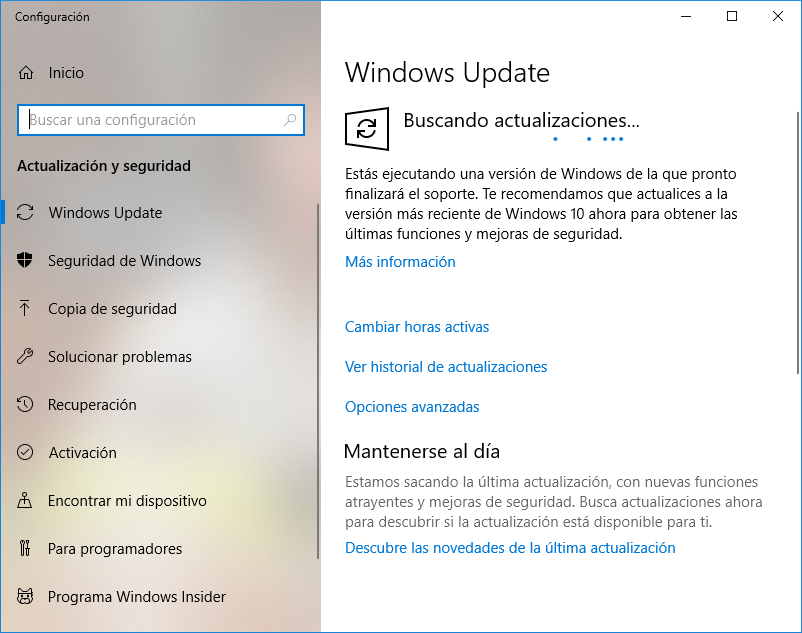

# Cómo actualizar Windows desde MEDUSA

Para poder actualizar los sistemas Windows desde la red del instituto es necesario configurar un servidor proxy antes de lanzar las actualizaciones.

A continuación se explica el proceso:

1. [Configurar un servidor proxy](configurar-proxy-windows).

2. Abrimos "Windows Update".

   - Botón de Inicio > Configuración > Actualización y seguridad > Windows Update

   

3. Pulsamos el botón "Buscar actualizaciones".

4. En caso de que encuentre actualizaciones, le diremos que las instale. 

5. Cuando termine es posible que debamos reiniciar el equipo.

6. Finalmente, quitamos el servidor proxy que configuramos antes. [IMPORTANTE]