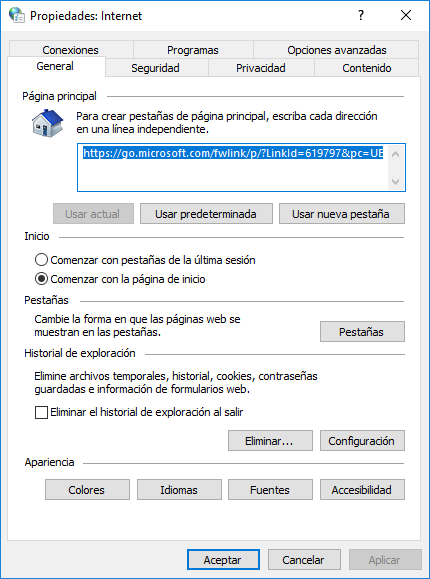
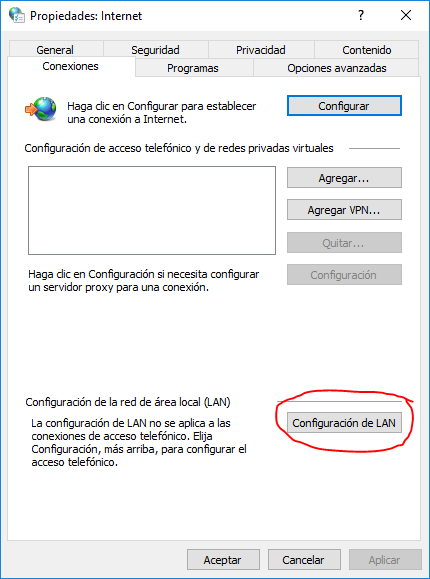
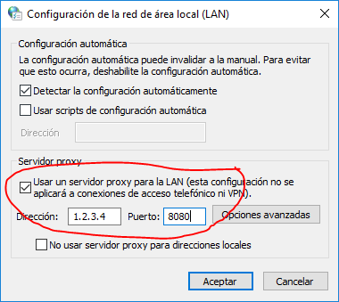

# Configurar un servidor proxy en Windows

A continuación se explican los pasos para configurar un [servidor proxy](https://es.wikipedia.org/wiki/Servidor_proxy) en Windows:

> :warning: Debemos tener en cuenta que al usar un proxy el tráfico de red de nuestro equipo pasará por ese servidor, por lo que puede ser inseguro.

1. Abrir "Opciones de Internet":

   

2. Seleccionar la pestaña "Conexiones" y pulsar el botón "Configuración de LAN":

   

3. Marcamos la casilla "Usar un servidor proxy para la LAN", introducimos la dirección y el puerto del proxy, y pulsamos "Aceptar".

   

Y listo. Con esto ya hemos configurado el servidor proxy para Windows.

> Podemos encontrar servidores proxy en Internet buscando por `free proxy list`.

