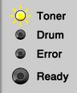

Resetear la alarma de tóner en la impresora Brother HL-2250-DN
=========================================================

Si el LED de aviso de tóner bajo de la impresora se mantiene encendido aunque cambiemos el tóner, es necesario resetear la alarma de tóner bajo siguiendo los siguientes pasos:

1.  Apagar la impresora.

2.  Abrir la cubierta frontal, donde se coloca el tóner.

3.  Mantener pulsado el botón "GO" y encender la impresora (dejar GO pulsado).

4.  Cuando se enciendan los 3 LEDs (Tóner, Drum y Error), soltamos "GO" y lo volvemos a pulsar 2 veces.

5.  A continuación se encienden todas las luces sin parpadear.

6.  Pulsamos GO 5 veces.

7.  Se enciende la luz de "Error".

8.  Cerramos la cubierta frontal.

¡Y listo! Ya podemos volver a usar la impresora.

