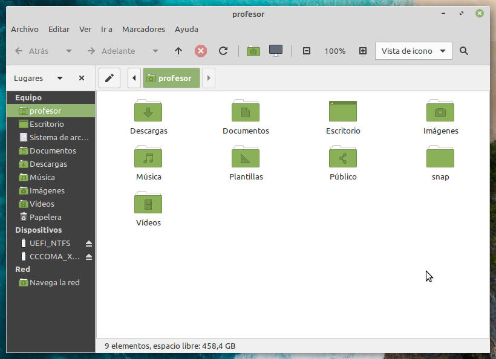
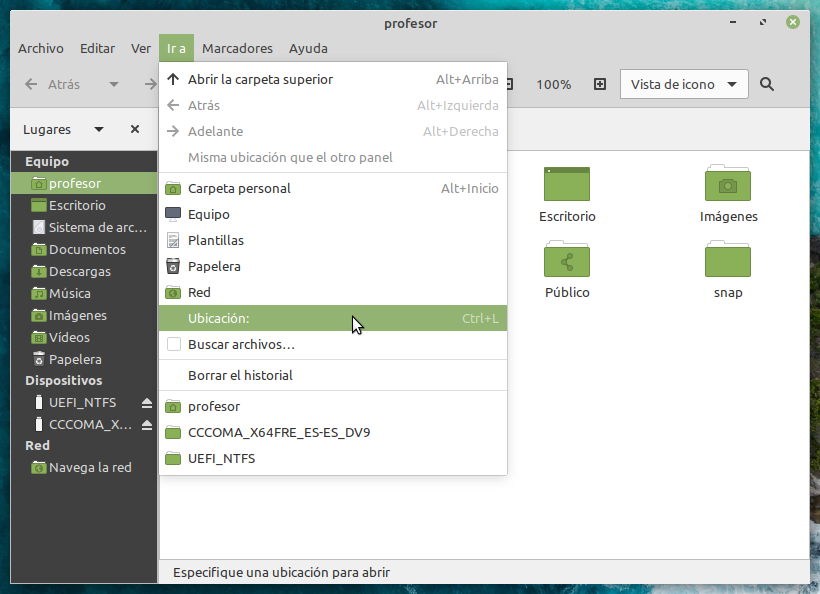
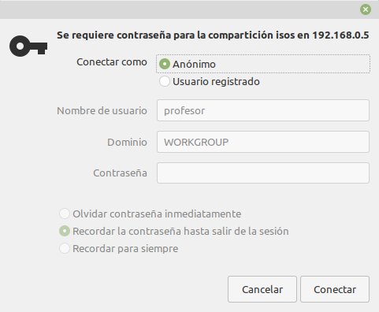

# Conectar a una carpeta compartida desde LinuxMint

Para poder conectar a una carpeta compartida mediante el protocolo SMB (protocolo nativo de Windows para compartir carpetas, e implementado en sistemas GNU/Linux mediante SAMBA) desde un sistema GNU/Linux, seguimos los siguientes pasos:

1. Abrimos el **Gestor de archivos** (similar al **Explorador de archivos** en Windows):



2. Abrimos la opción del menú **Ir a > Ubicación**:

	

3. Introducimos la dirección de la carpeta compartida:

	```
	smb://servidor/carpeta
	```

	Donde el **servidor** puede ser tanto la dirección IP como el nombre del servidor, y **carpeta** sería el nombre de la carpeta compartida en el servidor.

	> **Por ejemplo:** `smb://172.17.198.254/isos` nos lleva a una carpeta compartida dentro de un servidor del centro con ISOs de instalación de sistemas operativos.

4. Indicamos las credenciales del usuario para poder acceder a la carpeta:

	

	> Según se haya configurado en el servidor, es posible acceder como un usuario **anónimo**, que normalmente sólo tiene permisos de lectura.

5. Y ya tenemos acceso al contenido de la carpeta.

	***[FALTA CAPTURA DE PANTALLA]***

