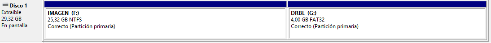
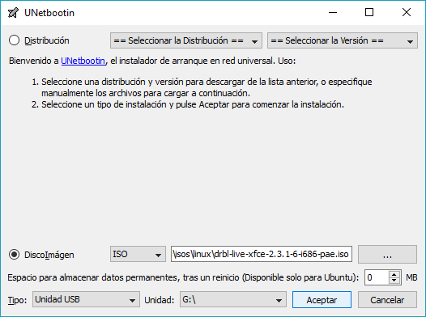

# Creación de un pendrive de recuperación para los equipos de las aulas con DRBL

A continuación se explica el proceso para preparar un pendrive que permita crear y restaurar imágenes de disco, de forma que en el mismo pendrive se almacenen dichas imágenes.

1. Crear dos particiones en el pendrive de la siguiente forma. En este caso se ha usado el "Administrador de discos" de Windows, pero se puede hacer lo mismo con el GParted en GNU/Linux.

   

   La primera partición se debe formatear en NTFS y es donde se guardarán la(s) imagen(es). Debe ser NTFS para que quepan archivos de más de 4GB.

   La segunda partición la formateamos en FAT32, y es donde se pondrá la imagen de [DRBL](https://drbl.org/).

   > **NOTA1**: El orden en que se crean las particiones afecta a la numeración de las mismas por parte de GNU/Linux, luego se deben crear en el orden indicado para que al iniciar DRBL se pueda montar la partición con las imágenes.

   > **NOTA2**: En este caso se ha usado un pendrive de 32GB. Hemos dejado unos 4GB de espacio en el pendrive para el DRBL (unidad G:) y el resto es para la imagen. El tamaño del pendrive deberá ser el adecuado para que quepa la imagen en la partición "IMAGEN".

2. Con la aplicación **[UNetBootin](https://unetbootin.github.io/)** (disponible tanto para Windows como para GNU/Linux), volcamos el contenido de la ISO de DRBL a la segunda partición (en este caso a la unidad con la letra G:)

   

   > **NOTA**: En este ejemplo se está usando la versión [2.3.1 de DRBL de 32 bits (i686)](https://sourceforge.net/projects/drbl/files/drbl_live_stable/OldFiles/2.3.1-6/drbl-live-xfce-2.3.1-6-i686-pae.iso/download), para que funcione también en equipos antiguos.

3. Arrancar el equipo del/al que queremos hacer/restaurar imagen con este pendrive.

   La imagen se deberá crear usando el "Clonezilla Live" ahora disponible en el pendrive y guardar en la partición IMAGEN.
